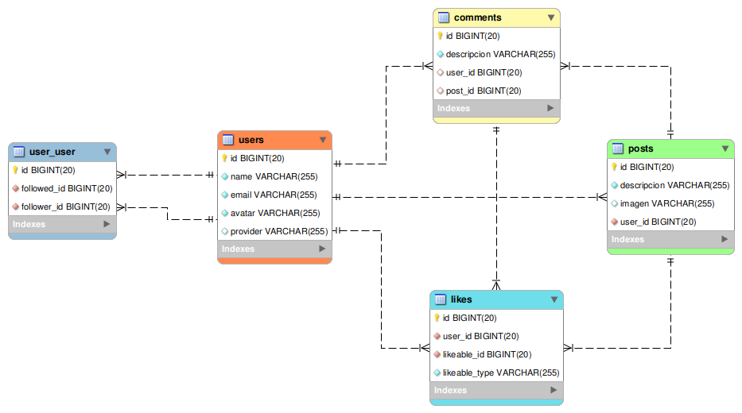

# Public Table
Public Table está hecho en Laravel v8, es un proyecto para demostrar los conocimientos que tengo hasta ahora sobre Laravel.

# Demo
Puede verse la aplicación en producción en **[Public-table.herokuapp.com](https://public-table.herokuapp.com/)**.

## Componentes de Laravel usados
    
- **Laravel Socialite:** Para el login con un correo electrónico de Google.

- **Policies:** Para evitar que un usuario elimine la publicación (o cualquier contenido) de otro usuario.

- **Pagination:** Para mostrar las ultimas publicaciones (comentarios, likes, o notificaciones) y cargar más cuando el usuario llegue al fondo de la página.

- **Resources:** Para limitar los atributos de los modelos en consultas asíncronas.

- **Eventos y Listeners:** Para crear notificaciones al hacer comentarios o likes.

- **Notification:** Para notificar a los usuarios sobre likes o comentarios nuevos.

- **Localization:** Para mostrar el texto de la página en Inglés y Español

- **Form request:** Para validar los datos al crear una publicación.

- **Migrations:** Para definir la estructura de la base de datos

- **Middleware:** Para establecer el lenguage de la aplicación en cada request.

- **Controllers y Models** 

## Otros conocimientos utilizados

- **Vue.js V3:** Para crear componentes como PostComponent, CommentComponent, NotificationComponent, etc. Además se publicó dos componentes en npmjs.com:
    - **[v-simple-infinite-scroll](https://www.npmjs.com/package/v-simple-infinite-scroll):** Para cargar más contenido cuando el scroll llegue al final. Soporta scroll en window y div.
    - **[v-simple-guided-tour](https://www.npmjs.com/package/v-simple-guided-tour):** Para mostrar un dialogo que explica las partes de la interfaz de la página web.
- **Bootstrap V5:** Para el diseño del sitio.
- **Poppers.js:** Para mostrar dialogos.
- **Masonry:** Para ordenar las columnas con un aspecto similar a Pinterest.com
- **Axios:** Para las consultas javascript asíncronas.

## Modelo de base de datos

## Autor

Amilcar Maximo Laura Canaza
